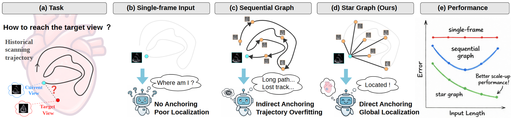
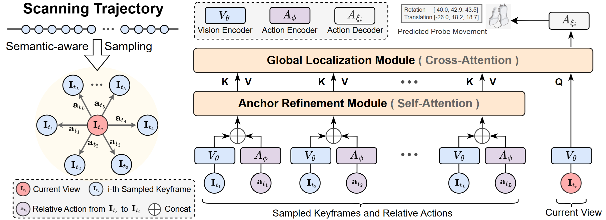
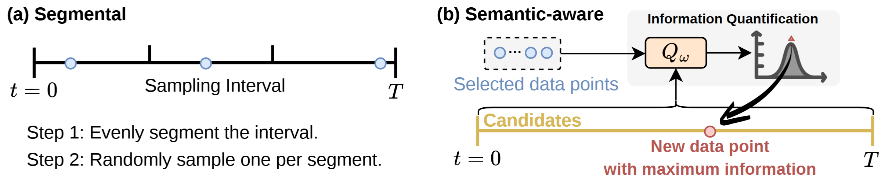

<div align="center">

# UltraStar: Semantic-Aware Star Graph Modeling for Echocardiography Navigation
</div>

<h2 align="center">MICCAI 2026</h2>

This repository contains the official implementation of **UltraStar: Semantic-Aware Star Graph Modeling for Echocardiography Navigation**.

Paper: [https://arxiv.org/abs/2603.01461](https://arxiv.org/abs/2603.01461)

## Abstract

Echocardiography is critical for diagnosing cardiovascular diseases, yet the shortage of skilled sonographers hinders timely patient care, due to high operational difficulties. Consequently, research on automated probe navigation has significant clinical potential. To achieve robust navigation, it is essential to leverage historical scanning information, mimicking how experts rely on past feedback to adjust subsequent maneuvers. Practical scanning is an exploratory trial-and-error process that inherently generates noisy trajectories. However, existing methods typically model this history as a sequential chain, forcing models to overfit these noisy paths, leading to performance degradation on long sequences. In this paper, we propose UltraStar, which reformulates probe navigation from path regression to anchor-based global localization. By establishing a Star Graph, UltraStar treats historical keyframes as spatial anchors connected directly to the current view, explicitly modeling geometric constraints for precise positioning. We further enhance the Star Graph with a semantic-aware sampling strategy that actively selects the representative landmarks from massive history logs, reducing redundancy for accurate anchoring. Extensive experiments on a dataset with over 1.31 million samples demonstrate that UltraStar outperforms baselines and scales better with longer input lengths, revealing a more effective topology for history modeling under noisy exploration.


## Overview


Comparison of modeling paradigms.
(a) The echocardiography navigation task.
(b) Single-frame methods struggle with localization due to limited context.
(c) Sequential Graph methods model history as a chain, forcing the model to overfit noisy exploration trajectories and degrading localization accuracy.
(d) Our Star Graph breaks the chain, treating historical keyframes as global anchors and learning direct geometric constraints for precise localization.
(e) Our method achieves lower error and scales better.


## Method

We propose UltraStar, a simple yet effective framework that shifts from chain-based modeling to a Star Graph topology. 
By treating historical keyframes as spatial anchors and directly connecting them to the current view, UltraStar learns the geometric constraints between the current state and historical landmarks, enabling robust localization and superior scalability.
Furthermore, raw scanning history can be excessively long and sparse, making full-trajectory processing computationally infeasible. 
We therefore propose a semantic-aware sampling strategy that selects keyframe landmarks with high semantic divergence, constructing a compact yet informative map for the Star Graph. 

- Illustration of the Star Graph modeling paradigm.



- Diagram of segmental sampling and idea of semantic-aware sampling.



## Environment

The code has been tested with the following core dependencies:

```text
Python 3.10.14
PyTorch 2.0.0+cu118
numpy 1.26.4
einops
scipy
matplotlib
tqdm
```

We recommend creating a clean conda environment:

```bash
conda create -n ultrastar python=3.10.14 -y
conda activate ultrastar
```

Install PyTorch with CUDA 11.8 support:

```bash
pip install torch==2.0.0+cu118 torchvision==0.15.1+cu118 torchaudio==2.0.1 \
    --index-url https://download.pytorch.org/whl/cu118
```

Install commonly used dependencies:

```bash
pip install einops scipy matplotlib tqdm numpy
```
Please note that the packages listed above are only the core dependencies used in our experiments. Additional packages may be required.


## Training

UltraStar training consists of three stages:

1. Pretrain the image encoder with I-JEPA.
2. Run view classification inference to obtain semantic logits for semantic-aware sampling.
3. Train the echocardiography navigation model with the proposed Star Graph modeling framework.

### 1. Pretrain Image Encoder

We use the I-JEPA framework to pretrain the image encoder on echocardiography images. Please follow the official I-JEPA repository for pretraining:

```text
https://github.com/facebookresearch/ijepa
```

After pretraining, place the checkpoint at:

```text
pretrained_encoder/ijepa-ep300.pth.tar
```

The pretrained image encoder is then frozen and used to extract echocardiography image features for UltraStar navigation training.

**Note:** The I-JEPA encoder is pretrained only on training scans to ensure zero data leakage.

### 2. View Classification Inference

To enable the semantic-aware sampling strategy, we train a view classification model and use its output logits as semantic descriptors for each image. These semantic descriptors are used to select representative keyframe landmarks from historical scanning trajectories.

Run view classification inference with:

```bash
python view_classification_infer.py
```

After inference, the semantic logits for each image will be saved and used during navigation model training.

**Note:** The view classifier is trained only on training scans to ensure zero data leakage.

### 3. Train Navigation Model

After preparing the pretrained encoder and semantic logits, train the UltraStar navigation model with:

```bash
CUDA_VISIBLE_DEVICES=0,1,2,3,4,5,6,7 python main.py \
    --base_model ijepa \
    --epochs 5 \
    --batch-size 128 \
    --lr 1e-4 \
    --lr_f 1e-6 \
    --timestep 8 \
    --data_root data \
    --logs logs \
    --dist-url 'tcp://127.0.0.1:23410' \
    --dist-backend 'nccl' \
    --multiprocessing-distributed \
    --world-size 1 \
    --rank 0 \
    --num-workers 16 \
    --equal_loss \
    --drop_path_rate 0.2 \
    --layer_decay 0.4 \
    --freeze_encoder \
    --encoderpath pretrained_encoder/ijepa-ep300.pth.tar
```

Please modify the following arguments according to your local environment:

* `--data_root`: path to the echocardiography navigation dataset.
* `--logs`: directory for saving training logs and checkpoints.
* `--encoderpath`: path to the pretrained I-JEPA encoder checkpoint.
* `CUDA_VISIBLE_DEVICES`: GPU IDs used for training.


## Evaluation

After training, the best checkpoint is saved in the directory specified by `--logs`. The checkpoint with the best validation MAE can be used for evaluation by setting the `--pretrain_weights` argument.

Run evaluation with:

```bash
CUDA_VISIBLE_DEVICES=0,1,2,3,4,5,6,7 python only_val.py \
    --base_model ijepa \
    --epochs 5 \
    --batch-size 128 \
    --lr 1e-4 \
    --lr_f 1e-6 \
    --timestep 8 \
    --data_root data \
    --logs logs/only_val \
    --dist-url 'tcp://127.0.0.1:23410' \
    --dist-backend 'nccl' \
    --multiprocessing-distributed \
    --world-size 1 \
    --rank 0 \
    --num-workers 16 \
    --sample_mode semantic_aware \
    --equal_loss \
    --drop_path_rate 0.2 \
    --layer_decay 0.4 \
    --freeze_encoder \
    --encoderpath pretrained_encoder/ijepa-ep300.pth.tar \
    --pretrain_weights logs/path_to_training_exp/best_mae.pth
```

Please modify the following arguments according to your local environment:

* `--data_root`: path to the echocardiography navigation dataset.
* `--logs`: directory for saving evaluation logs.
* `--pretrain_weights`: path to the best checkpoint obtained during the training stage, usually named `best_mae.pth`.
* `CUDA_VISIBLE_DEVICES`: GPU IDs used for evaluation.


## Reference

If you find our project useful in your research, please consider citing:

```bibtex
@misc{wang2026ultrastar,
      title={UltraStar: Semantic-Aware Star Graph Modeling for Echocardiography Navigation}, 
      author={Teng Wang and Haojun Jiang and Chenxi Li and Diwen Wang and Yihang Tang and Zhenguo Sun and Yujiao Deng and Shiji Song and Gao Huang},
      year={2026},
      eprint={2603.01461},
      archivePrefix={arXiv},
      primaryClass={cs.CV},
      url={https://arxiv.org/abs/2603.01461}, 
}
```